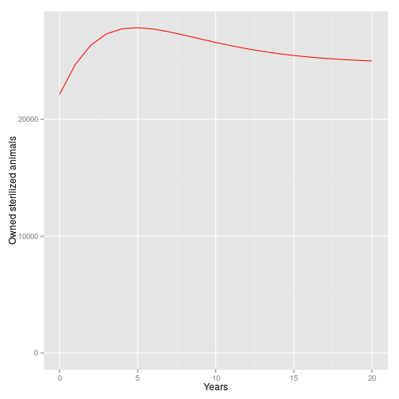
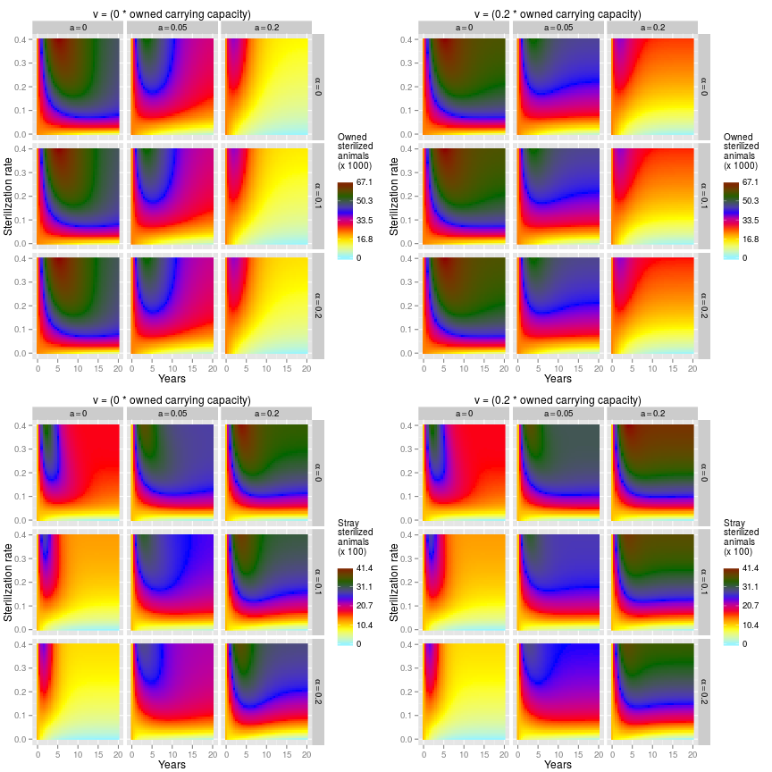

```
## Error in eval(expr, envir, enclos): could not find function "option"
```


Now we are ready to simulate the effect of immigration, abandonment, sterilization and adoption, on owned and stray population dynamics. `SolveIASA` function uses many parameters to run a mathematical model of population dynamics. Some parameters are from the owned population and others from the stray population (the help page for `SolveIASA` descrbies parameter abbreviation).  

We have estimates for almost all parameters of the owned population but we have no estimates for the stray population. Based on literature and expert opinions, we can define subjective estimates for the stray population (in the next section we will assess how much the subjective estimates compromises the model results).

Values to define the initial conditions.


```r
> # Owned dogs            # Stray dogs
> f1 <- 39565 - 12783;    f2 <- f1 * 0.1
> fs1 <- 12783;           fs2 <- fs1 * 0.05
> m1 <- 50289 - 9346;     m2 <- m1 * 0.1
> ms1 <- 9346;            ms2 <- ms1 * 0.05
```

Values to define the parameters.


```r
> # Owned dogs            # Stray dogs
> b1 <-  7724;            b2 <- b1 * 0.15
> df1 <- 0.046;           df2 <- df1 * 1.15
> dm1 <- 0.053;           dm2 <- dm1 * 1.15
> sf1 <- 0.13;            sf2 <- sf1 * 0.05
> sm1 <- 0.043;           sm2 <- sm1 * 0.05
> k1 <- (f1 + m1) * 1.1;  k2 <- (f2 + m2) * 1.1
> h1 <- 1;                h2 <- 0.5;
> a <- 0.05;              alpha <- 0.104;
> v <- 0.147
> z <- v * 0.11
```

Initial conditions and parameters.


```r
> init.solve.iasa = c(
+     f1 = f1, fs1 = fs1,
+     m1 = m1, ms1 = ms1,
+     f2 = f2, fs2 = fs2,
+     m2 = m2, ms2 = ms2)
> 
> pars.solve.iasa = c(
+     b1 = b1, b2 = b2, df1 = df1,
+     dm1 = dm1, df2 = df2, dm2 = dm2,
+     sf1 = sf1, sf2 = sf2, sm1 = sm1,
+     sm2 = sm2, k1 = k1, k2 = k2,
+     h1 = h1, h2 = h2, a = a,
+     alpha = alpha, v = v, z = z)
```


Solving the model for point estimates is straightforward.


```r
> solve.iasa.pt <- SolveIASA(
+     pars = pars.solve.iasa,
+     init = init.solve.iasa,
+     time = 0:20, method = 'rk4')
```

We might be interested in how much different subpopulations change through time. For example, let's calculate the relative change in the total number of owned sterilized dogs from the beginning to the end of the simulated period


```r
> CalculatePopChange(
+     model.out = solve.iasa.pt,
+     variable = 'ns1',
+     t1 = 0, t2 = 20)
```

```
[1] At t2, ns1 is 12.94% higher than (or 112.94% times) ns1 at t1.
```

and the absolute change in the number of stray intact females from the fifth to the tenth year.


```r
> CalculatePopChange(
+     model.out = solve.iasa.pt,
+     variable = 'fs2',
+     t1 = 5, t2 = 10, ratio = F)
```

```
Compared with t1, in t2 fs2 is increased by 54.91
```

The dynamics of different subpopulations can be plotted too (see the help page for `PlotModels`).


```r
> PlotModels(model.out = solve.iasa.pt,
+            variable = 'ns1')
```

 

We can also simulate scenarios to assess the interaction between different combinations of sterilization, abandonment, adoptions and immigration rates. In the following example we will create 900 scenarios (50 sterilization rates, 3 abandonment rates, 3 adoption rates and 2 immigration rates).


```r
> solve.iasa.rg <- SolveIASA(
+     pars = pars.solve.iasa,
+     init = init.solve.iasa,
+     time = seq(0, 20, by = 0.5),
+     s.range = seq(from = 0, to = 0.4,
+                   length.out = 50),
+     a.range = c(0, .2),
+     alpha.range = c(0, .2),
+     v.range = c(0, .2),
+     method = 'rk4')
> PlotModels(model.out = solve.iasa.rg,
+            variable = 'ns')
```

 
