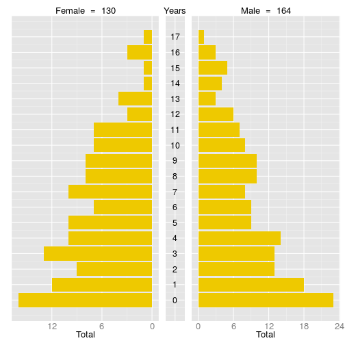
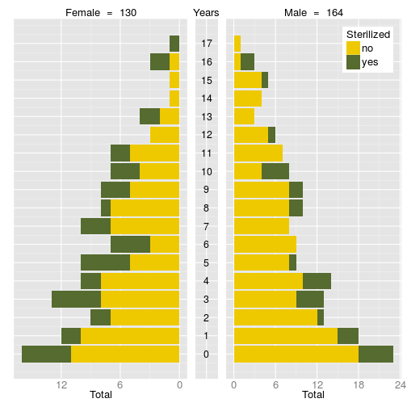

Population pyramids summarizes the basic composition of a population. At minimum, they are built from "age" and "sex"" variables but they can be conditioned on a third categorical variable. Those variables must be specified in the respective function arguments.


```r
> head(survey.data)
```

```
  interview_id        psu dogs    sex age sterilized
1            1 3.5485e+14    1   Male   9        yes
2            1 3.5485e+14    1 Female   1         no
3            2 3.5485e+14    1 Female   7        yes
4            3 3.5485e+14    1   Male  11         no
5            4 3.5485e+14    1 Female  13         no
6            5 3.5485e+14    1 Female   3         no
  sterilized.ly births present    fate     acquired outside
1           yes      0     yes in_home       bought      no
2            no      0     yes in_home       bought      no
3            no      0     yes in_home       bought      no
4            no      0     yes in_home born_in_home      no
5            no      0     yes in_home         gift     yes
6            no      0     yes in_home      adopted      no
  acquired.ly immigrant immigrant.ly immigrant.sterilized.ly
1          no       yes         <NA>                    <NA>
2         yes       yes          yes                      no
3         yes       yes          yes                      no
4          no        no           no                    <NA>
5          no       yes         <NA>                    <NA>
6         yes        no           no                    <NA>
```

```r
> matrix(names(survey.data), ncol = 1)
```

```
      [,1]                     
 [1,] "interview_id"           
 [2,] "psu"                    
 [3,] "dogs"                   
 [4,] "sex"                    
 [5,] "age"                    
 [6,] "sterilized"             
 [7,] "sterilized.ly"          
 [8,] "births"                 
 [9,] "present"                
[10,] "fate"                   
[11,] "acquired"               
[12,] "outside"                
[13,] "acquired.ly"            
[14,] "immigrant"              
[15,] "immigrant.ly"           
[16,] "immigrant.sterilized.ly"
```

```r
> PlotPopPyramid(dat = survey.data,
+                age.col = 'age',
+                sex.col = 'sex')
```

 

```r
> PlotPopPyramid(dat = survey.data,
+                age.col = 5,
+                sex.col = 4,
+                str.col = 6)
```

 


