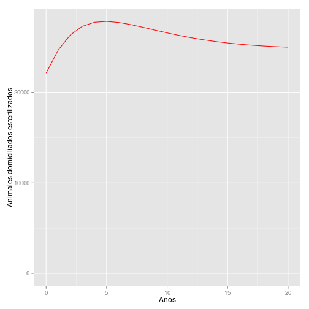
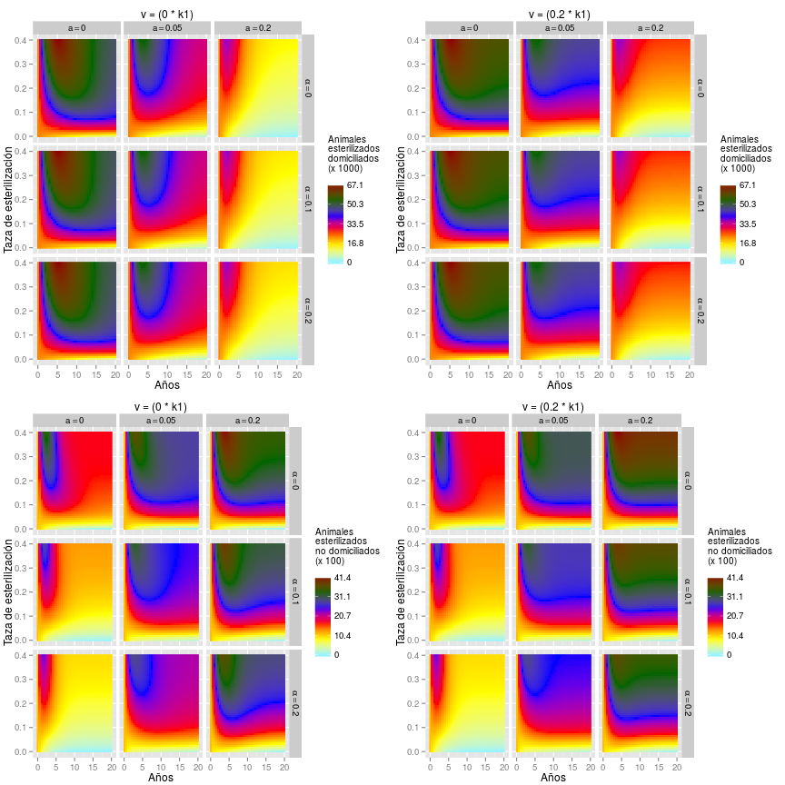

## Evaluando el efecto de las intervenciones

Ahora estamos listos para simular el efecto de la inmigración, el abandono, la esterilización y la adopción, en la dinámica pobacional de perros de casa y callejeros. La función `SolveIASA` usa varios parámetros en un modelo de dinámica poblacional. Algunos parámetros son de perros de casa y otros de callejeros (la página de ayuda de `SolveIASA` describe las abreviaciones de los parámetros).  

Tenemos estimativas para casi todos los parámetros de la población de perros de casa pero no tenemos estimativas para la población de callejeros. Con base en la literatura y en la opinión de expertos, podemos definir estimativas subjetivas para la población de callejeros (en la siguiente sección evaluaremos que tanto las estimativas subjetivas comprometen los resultados del modelo).

Valores para definir las condiciones iniciales.


```r
> # Perros de casas       # Perros callejeros
> f1 <- 39565 - 12783;    f2 <- f1 * 0.1
> fs1 <- 12783;           fs2 <- fs1 * 0.05
> m1 <- 50289 - 9346;     m2 <- m1 * 0.1
> ms1 <- 9346;            ms2 <- ms1 * 0.05
```

Valores para definir los parámetros.


```r
> # Perros de casas       # Perros callejeros
> b1 <-  7724;            b2 <- b1 * 0.15
> df1 <- 0.046;           df2 <- df1 * 1.15
> dm1 <- 0.053;           dm2 <- dm1 * 1.15
> sf1 <- 0.13;            sf2 <- sf1 * 0.05
> sm1 <- 0.043;           sm2 <- sm1 * 0.05
> k1 <- (f1 + m1) * 1.1;  k2 <- (f2 + m2) * 1.1
> h1 <- 1;                h2 <- 0.5;
> a <- 0.05;              alpha <- 0.104;
> v <- 0.147
> z <- v * 0.11
```

Parámetros y condiciones iniciales.


```r
> init.solve.iasa = c(
+     f1 = f1, fs1 = fs1,
+     m1 = m1, ms1 = ms1,
+     f2 = f2, fs2 = fs2,
+     m2 = m2, ms2 = ms2)
> 
> pars.solve.iasa = c(
+     b1 = b1, b2 = b2, df1 = df1,
+     dm1 = dm1, df2 = df2, dm2 = dm2,
+     sf1 = sf1, sf2 = sf2, sm1 = sm1,
+     sm2 = sm2, k1 = k1, k2 = k2,
+     h1 = h1, h2 = h2, a = a,
+     alpha = alpha, v = v, z = z)
```

Solucionar el modelo para las estimativas puntuales es simple.


```r
> solve.iasa.pt <- SolveIASA(
+     pars = pars.solve.iasa,
+     init = init.solve.iasa,
+     time = 0:20, method = 'rk4')
```

Podemos estar interesados en que tanto cambian diferentes subpoblaciones a través del tiempo. Por ejemplo, calculemos el cambio relativo del total perros de casa esterilizados, desde el comienzo hasta el final del periodo simulado


```r
> CalculatePopChange(
+     model.out = solve.iasa.pt,
+     variable = 'ns1',
+     t1 = 0, t2 = 20)
```

```
[1] At t2, ns1 is 12.94% higher than (or 112.94% times) ns1 at t1.
```

y el cambio absoluto del total de hembras callejeras no esterilizadas, entre el quinto y el décimo año.


```r
> CalculatePopChange(
+     model.out = solve.iasa.pt,
+     variable = 'fs2',
+     t1 = 5, t2 = 10, ratio = F)
```

```
Compared with t1, in t2 fs2 is increased by 54.91
```

La dinámica de diferentes subpoblaciones también puede ser plotada (ver la página de ayuda de `PlotModels`).


```r
> PlotModels(model.out = solve.iasa.pt,
+            variable = 'ns1',
+            x.label = 'Años',
+            y.label = 'Animales domiciliados esterilizados')
```

 

También podemos simular escenarios para evaluar la interacción entre diferentes combinaciones de tazas de esterilización, abandono, adopción e inmigración. En el siguiente ejemplo crearemos 900 escenarios (50 tazas de esterilización, 3 tazas de abandono, 3 tazas de adopción y 2 tazas de inmigración).


```r
> solve.iasa.rg <- SolveIASA(
+     pars = pars.solve.iasa,
+     init = init.solve.iasa,
+     time = seq(0, 20, by = 0.5),
+     s.range = seq(from = 0, to = 0.4,
+                   length.out = 50),
+     a.range = c(0, .2),
+     alpha.range = c(0, .2),
+     v.range = c(0, .2),
+     method = 'rk4')
> PlotModels(model.out = solve.iasa.rg,
+            variable = 'ns',
+            x.label = 'Años',
+            y.label = 'Taza de esterilización',
+            scenarios.label = 'v = (__ * k1)',
+            legend.label = c('Animales\nesterilizados\ndomiciliados',
+                             'Animales\nesterilizados\nno domiciliados'))
```

 
