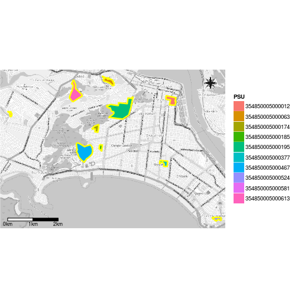
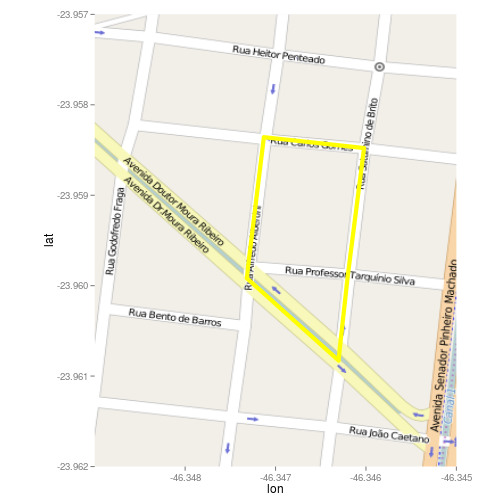

```
## Error in options(width == 66): object 'width' not found
```


Para el diseño por conglomerados en dos etapas (ver sección anterior), casi siempre es necesario mapear las UPM para saber a donde debemos ir. Afortunadamente el `capm` tiene una función para mapear las UPM. Si tenemos un shapefile de las UPM estamos hechos - como en este caso. El el área de trabajo hay cinco archivos llamados "santos", cada uno con una extensión diferente. Todos estos archivos son una representación shapefile de las UPM del área de muestreo (ciudad de Santos). Estos archivos también fueron obtenidos en el IBGE (ver sección anterior).


```r
> MapkmlPSU(shape = 'santos',
+           psu = pilot.psu[, 1],
+           id = 1)
```

`MapkmlPSU` crea un archivo "kml" para cada UPM seleccionada y un "kml" con todas las UPM seleccionadas. Estos archivos pueden ser abiertos con apenas cliando sobre los mismos. [QGIS](http://qgis.org) es una herramienta de código abierto que también "renderiza" capas de base para los archivos "kml". 

Por supuesto, R nos permite plotar las localizaciones de las UPM seleccionadas. No se preocupen si no entienden el siguiente fragmento de código, pués es apenas otra alternativa para Google Earth y QGIS.

Si aparece el error "503 Service Unavailable", debemos intentar más tarde para ver si el servidos OSM vuelve a funcionar (ver la página de ayuda de `get_openstreetmap`).


```r
> # El paquete rgeos debe estar instalado.
> library(rgdal); library(ggmap); library(ggsn)
> santos <- readOGR(dsn = '.', layer = 'santos')
```

```
OGR data source with driver: ESRI Shapefile 
Source: ".", layer: "santos"
with 666 features
It has 1 fields
```

```r
> santos.pilot <- santos[
+     as.character(santos@data[ , 1]) %in%
+         pilot.psu[ , 1], ]
> santos.pilot <- spTransform(
+     santos.pilot,
+     CRS('+init=epsg:4326'))
> santos.pilot@data$id <-
+     rownames(santos.pilot@data)
> santos.pilot.points <- fortify(santos.pilot,
+                                region = "id")
> santos.pilot.df <- merge(santos.pilot.points,
+                          santos.pilot@data,
+                          by = "id")
> 
> osm.all.psu <- get_openstreetmap(
+     bbox = c(-46.386, -23.991, -46.298, -23.929),
+     scale = 34000, color = 'bw')
> 
> ggmap(osm.all.psu, extent = 'device') + 
+     geom_polygon(
+         data = santos.pilot.df,
+         aes(x = long, y = lat, fill = PSU)) +
+     coord_equal() +
+     geom_path(data = santos.pilot.df,
+               aes(long, lat, group = group),
+               color = 'yellow', size = 1.2) +
+     scalebar(santos.pilot.df, 'bottomleft',
+              dist = 1, dd2km = T,
+              model = 'WGS84', st.size = 3) +
+     north(santos.pilot.df, symbol = 15)
```

 

Sin importar el método usado para produzir los mapas, debemos diseñar una ruta en el mapa de cada UPM para poder ir por todas las calles. Podemos definir una residencia en un punto arbitrario (localización inferior isquierda) como la primera residencia y a partir de la misma, podemos seguir la ruta contando las residencias (incluyendo los dos lados de los fragmentos de calle totalmente contenidos en la UPM)  

El siguiente mapa muestra la cuarta UPM seleccionada.


```r
> osm.psu4 <- get_openstreetmap(
+     bbox = c(-46.349, -23.962, -46.345, -23.957),
+     scale = 5000)
> ggmap(osm.psu4) +
+     geom_polygon(data = santos.pilot[4, ],
+                  aes(x = long, y = lat),
+                  fill = NA,
+                  color = 'yellow', size = 2) +
+     coord_equal()
```

```
Regions defined for each Polygons
```

 
