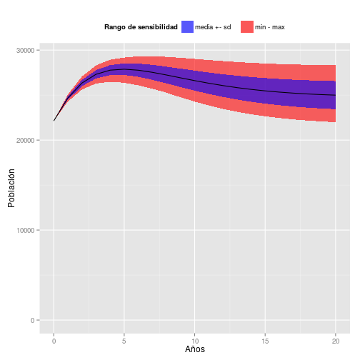
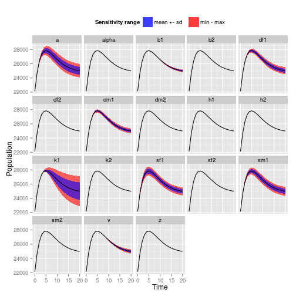
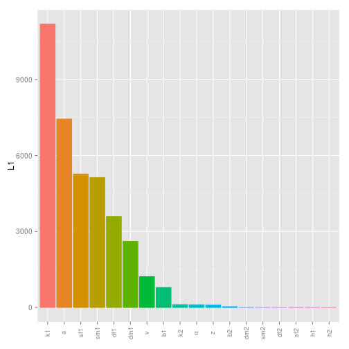

```
## Error in options(width == 66): object 'width' not found
```


Para finalizar, haremos análisis de sensibilidad global y local para clasificar los parámetros de acuerdo con la influencia que ejercen. Dado que las intervenciones de manejo poblacional son mecanismos para modificar (o mantener estables) parámetros poblacionales, la clasificación de parámetros es también una clasificación de intervenciones, o en otras palabras, una forma de priorizar las intervenciones.

Los análisis de sensibilidad global son usadas para evaluar la contribución de los parámetros del modelo, en la variación de los resultados. Con los análisis de sensibilidad global es posible adicionar incertezas a todos los parámetros y evaluar el efecto que produzen conjuntamente en la dinámica poblacional. A continuación perturbaremos simultáneamente cada parámetro en un intervalo cuyos límites inferior y superior son respectivamente, 10% menores y 10% superiores a las estimativas puntuales (para las capacidades de carga, no consideraremos valores menores a las estimativas puntuales).


```r
> rg.solve.iasa <-
+     SetRanges(pars = pars.solve.iasa,
+               range = 0.1)
> glob.all.solve.iasa <- CalculateGlobalSens(
+     model.out = solve.iasa.pt,
+     ranges = rg.solve.iasa,
+     sensv = 'ns1', all = T)
> PlotGlobalSens(global.out = glob.all.solve.iasa,
+                x.label = 'Años',
+                y.label = 'Población',
+                legend.label = 'Rango de sensibilidad',
+                sd.label = 'media +- sd    ')
```

 

```r
> glob.all.solve.iasa
```

```
       x     Mean        Sd      Min      Max      q05      q25      q50
ns10   0 22129.00    0.0000 22129.00 22129.00 22129.00 22129.00 22129.00
ns11   1 24673.57  203.0689 24265.52 25068.97 24340.58 24517.47 24677.79
ns12   2 26338.95  350.6093 25610.64 27065.17 25766.25 26096.31 26347.75
ns13   3 27312.89  462.1016 26290.19 28302.79 26556.36 27014.21 27337.06
ns14   4 27772.02  555.4797 26483.73 28934.80 26848.72 27367.13 27768.40
ns15   5 27878.84  643.8341 26371.39 29169.82 26817.02 27452.44 27873.03
ns16   6 27766.81  735.2952 26083.89 29311.29 26592.46 27209.57 27743.23
ns17   7 27530.58  831.0931 25709.01 29320.01 26286.34 26942.50 27540.14
ns18   8 27233.69  927.9505 25265.61 29251.78 25875.21 26600.45 27330.80
ns19   9 26917.43 1021.8003 24753.64 29143.77 25375.60 26211.10 27025.61
ns110 10 26607.50 1109.4806 24276.48 29020.08 24901.31 25848.53 26546.62
ns111 11 26318.85 1189.0938 23846.99 28895.68 24484.00 25528.90 26155.88
ns112 12 26059.22 1259.8211 23470.11 28779.33 24112.55 25262.39 25902.12
ns113 13 25831.60 1321.6109 23145.81 28675.65 23791.83 24987.26 25650.24
ns114 14 25636.03 1374.8967 22871.11 28586.54 23525.99 24746.55 25447.53
ns115 15 25470.76 1420.3840 22641.48 28512.21 23293.08 24542.22 25290.72
ns116 16 25333.08 1458.9027 22451.72 28451.88 23107.04 24354.95 25154.34
ns117 17 25219.86 1491.3116 22296.51 28404.20 22959.31 24205.37 25033.47
ns118 18 25127.87 1518.4402 22170.76 28367.61 22840.88 24062.56 24938.45
ns119 19 25054.02 1541.0557 22069.82 28340.47 22737.65 23937.08 24861.55
ns120 20 24995.46 1559.8479 21989.52 28321.23 22654.09 23835.66 24799.98
           q75      q95
ns10  22129.00 22129.00
ns11  24815.90 25005.28
ns12  26582.00 26927.37
ns13  27610.66 28114.24
ns14  28118.00 28755.95
ns15  28250.38 29013.21
ns16  28192.58 29066.22
ns17  27986.06 29056.14
ns18  27787.86 28964.37
ns19  27555.37 28830.04
ns110 27318.07 28678.17
ns111 27096.19 28524.69
ns112 26907.38 28379.22
ns113 26743.10 28247.07
ns114 26599.94 28130.66
ns115 26478.04 28030.58
ns116 26378.45 27946.27
ns117 26300.52 27875.96
ns118 26235.52 27818.67
ns119 26183.59 27772.80
ns120 26142.76 27736.72
```

A diferencia de simulaciones basadas solo en estimativas puntuales, aquí obtuvimos un conjunto de posibles resultados representados por una envoltura, en lugar de un único resultado representado por una línea.  

Para algunos parámetros obtuvimos las estimativas usando técnicas de muestreo mientras que para otros, las estimativas fueron subjetivas. Dado que hay incertezas en relación a los valores exactos de los parámetros, los resultados de las perturbaciones también representan nuestras incertezas.  

Una questión que surge es: ¿La dinámica poblacional es igualmente sensible a todos los parámetros? Si no ¿Cuáles son los parametros más influyentes? Una forma de responder estas preguntas consiste en la realización de análisis de sensibilidad global, perturbando un parámetro por vez y fijando los restantes en las estimativas puntuales.


```r
> glob.solve.iasa <- CalculateGlobalSens(
+     model.out = solve.iasa.pt,
+     ranges = rg.solve.iasa,
+     sensv = 'ns1', all = F)
> PlotGlobalSens(global.out = glob.solve.iasa,
+                x.label = 'Años',
+                y.label = 'Población',
+                legend.label = 'Rango de sensibilidad',
+                sd.label = 'media +- sd    ')
```

 

```r
> head(glob.solve.iasa)
```

```
     x     Mean        Sd      Min      Max      q05      q25      q50
ns10 0 22129.00 0.0000000 22129.00 22129.00 22129.00 22129.00 22129.00
ns11 1 24674.08 0.0000000 24674.08 24674.08 24674.08 24674.08 24674.08
ns12 2 26340.38 0.0000000 26340.38 26340.38 26340.38 26340.38 26340.38
ns13 3 27304.92 0.0000000 27304.92 27304.92 27304.92 27304.92 27304.92
ns14 4 27743.21 0.4989071 27742.36 27744.06 27742.44 27742.79 27743.21
ns15 5 27837.27 2.7298551 27832.59 27841.91 27833.06 27834.94 27837.28
          q75      q95 param
ns10 22129.00 22129.00    b1
ns11 24674.08 24674.08    b1
ns12 26340.38 26340.38    b1
ns13 27304.92 27304.92    b1
ns14 27743.64 27743.98    b1
ns15 27839.60 27841.45    b1
```

Otra forma consiste en la realización de análisis de sensibilidad local. Aquí la idea es realizar pequñas perturbaciones y determinar la sensibilidad de cada parámetro usando medidas de influencia.


```r
> local.solve.iasa <-
+     CalculateLocalSens(model.out = solve.iasa.pt,
+                        sensv = 'ns1')
> PlotLocalSens(local.out = local.solve.iasa)
```

 

```r
> summary(local.solve.iasa)
```

```
        value   scale      L1      L2    Mean     Min     Max  N
b1    7.7e+03 7.7e+03   789.4  230.25   789.4     0.0  1911.5 21
b2    1.2e+03 1.2e+03    28.1    7.86   -28.1   -60.9     0.0 21
df1   4.6e-02 4.6e-02  3589.4  849.29 -3589.4 -4982.7     0.0 21
dm1   5.3e-02 5.3e-02  2609.4  613.75 -2609.4 -3444.7     0.0 21
df2   5.3e-02 5.3e-02     1.5    0.48    -1.5    -4.8     0.0 21
dm2   6.1e-02 6.1e-02     1.9    0.60     1.9     0.0     5.9 21
sf1   1.3e-01 1.3e-01  5268.9 1187.80  5268.9     0.0  6251.8 21
sf2   6.5e-03 6.5e-03     1.2    0.30     1.2     0.0     2.0 21
sm1   4.3e-02 4.3e-02  5129.0 1179.55  5129.0     0.0  6323.7 21
sm2   2.2e-03 2.2e-03     1.7    0.49     1.7     0.0     3.9 21
k1    7.4e+04 7.4e+04 11186.4 2993.87 11186.4     0.0 21109.7 21
k2    7.4e+03 7.4e+03   113.1   31.47   113.1     0.0   241.4 21
h1    1.0e+00 1.0e+00     0.0    0.00     0.0     0.0     0.0 21
h2    5.0e-01 5.0e-01     0.0    0.00     0.0     0.0     0.0 21
a     5.0e-02 5.0e-02  7439.2 1745.60 -7439.2 -9560.9     0.0 21
alpha 1.0e-01 1.0e-01   107.2   30.12   107.2     0.0   233.9 21
v     1.5e-01 1.5e-01  1218.5  353.22  1218.5     0.0  2909.6 21
z     1.6e-02 1.6e-02    99.2   27.03    99.2     0.0   199.4 21
```

Al ver las sensibilidades globales de cada parámetro y las sensibilidades locales, es claro que la capacidad de carga de la población de perros de casa es de lejos el parámetro más influyente para el total de perros de casa (cuanto mayor la envoltura (o la barra), mayor la influencia del respectivo parámetro).
