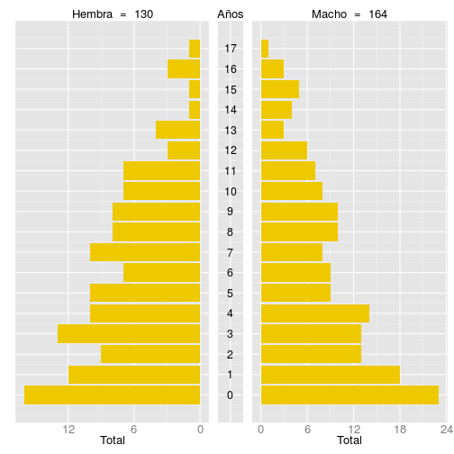
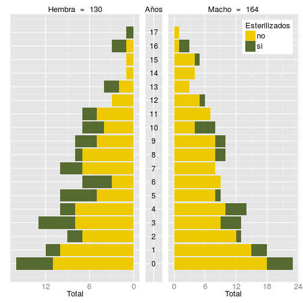

Las pirámides poblaciones resumen la composición básica de la población. Como mínimo, son construidas a partir de las variables "edad" y "sexo", pero pueden estar condicionadas por una tercera variable categórica. Las variables deben ser espcificadas en los respectivos argumentos de la función.


```r
> matrix(names(survey.data), ncol = 1)
```

```
      [,1]                     
 [1,] "interview_id"           
 [2,] "psu"                    
 [3,] "dogs"                   
 [4,] "sex"                    
 [5,] "age"                    
 [6,] "sterilized"             
 [7,] "sterilized.ly"          
 [8,] "births"                 
 [9,] "present"                
[10,] "fate"                   
[11,] "acquired"               
[12,] "outside"                
[13,] "acquired.ly"            
[14,] "immigrant"              
[15,] "immigrant.ly"           
[16,] "immigrant.sterilized.ly"
```

```r
> PlotPopPyramid(dat = survey.data,
+                age.col = 'age',
+                sex.col = 'sex')
```

 

```r
> PlotPopPyramid(dat = survey.data,
+                age.col = 5,
+                sex.col = 4,
+                str.col = 6)
```

 


