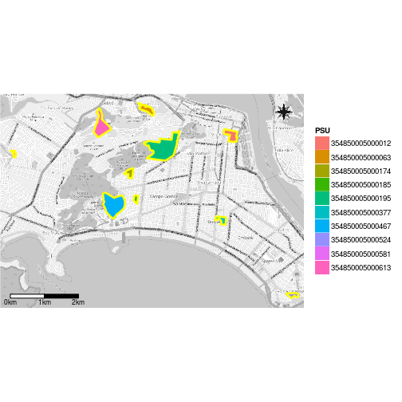
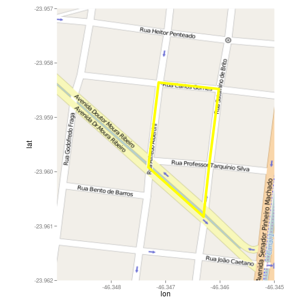

## Mapping sampling units

For two-stage cluster designs (see previous section), it is almost necessary to map the PSU's in order to know where we need to go. Fortunately, the `capm` has a function to map the PSU's. If we have a shapefile of the PSU's, we are done - as in this case. In the working directory, there are five files named as "santos", each one with a different extension. All those files are a shapefile representation of the PSU's from the sampled area (Santos city). We have got the files in the bureau of statistics mentioned in the previous section.  


```r
> MapkmlPSU(shape = 'santos',
+           psu = pilot.psu[, 1],
+           id = 1)
```

`MapkmlPSU` creates a "kml" file for each selected PSU plus a kml with all selected PSU's. Those kml files can be opened with Google Hearth just clicking on them. [QGIS](http://qgis.org) is an open source tool, which can also render different layers as a background to the kml files. 

Of course, R allow us to plot the locations of the selected PSU's. Do not worry if you do not understand the following code snippet, it is just another alternative to Google Hearth or QGIS.

If "503 Service Unavailable" error appears, try later to see if OSM servers come back (see the help page for `get_openstreetmap`).


```r
> # The package rgeos must be installed.
> library(rgdal); library(broom); library(ggmap); library(ggsn)
```

```
Loading required package: sp
```

```
rgdal: version: 1.1-8, (SVN revision 616)
 Geospatial Data Abstraction Library extensions to R successfully loaded
 Loaded GDAL runtime: GDAL 1.11.3, released 2015/09/16
 Path to GDAL shared files: /usr/share/gdal/1.11
 Loaded PROJ.4 runtime: Rel. 4.9.2, 08 September 2015, [PJ_VERSION: 491]
 Path to PROJ.4 shared files: (autodetected)
 Linking to sp version: 1.2-3 
```

```
Loading required package: ggplot2
```

```
Google Maps API Terms of Service: http://developers.google.com/maps/terms.
```

```
Please cite ggmap if you use it: see citation('ggmap') for details.
```

```r
> santos <- readOGR(dsn = '.', layer = 'santos')
```

```
OGR data source with driver: ESRI Shapefile 
Source: ".", layer: "santos"
with 666 features
It has 1 fields
```

```r
> santos.pilot <- santos[
+     as.character(santos@data[ , 1]) %in%
+         pilot.psu[ , 1], ]
> santos.pilot <- spTransform(
+     santos.pilot,
+     CRS('+init=epsg:4326'))
> santos.pilot@data$id <-
+     rownames(santos.pilot@data)
> santos.pilot.points <- fortify(santos.pilot)
```

```
Regions defined for each Polygons
```

```r
> santos.pilot.df <- merge(santos.pilot.points,
+                          santos.pilot@data,
+                          by = 'id')
> 
> osm.all.psu <- get_openstreetmap(
+     bbox = c(-46.386, -23.991, -46.298, -23.929),
+     scale = 34000, color = 'bw')
> 
> ggmap(osm.all.psu, extent = 'device') + 
+     geom_polygon(
+         data = santos.pilot.df,
+         aes(x = long, y = lat, fill = PSU)) +
+     coord_equal() +
+     geom_path(data = santos.pilot.df,
+               aes(long, lat, group = group),
+               color = 'yellow', size = 1.2) +
+     scalebar(santos.pilot.df, 'bottomleft',
+              dist = 1, dd2km = T,
+              model = 'WGS84', st.size = 3) +
+     north(santos.pilot.df, symbol = 15)
```



Whatever the method used to produce the maps, we must to sketch a route in the map of each selected PSU in order to go over all streets. We can set a household in an arbitrary point (i.e. the lower left location) as the first household. From it, we can go through the route counting the households (including both sides of streets fragment totally contained in the PSU) and interviewing those that were selected.  

The following map shows the fourth selected PSU.


```r
> osm.psu4 <- get_openstreetmap(
+     bbox = c(-46.349, -23.962, -46.345, -23.957),
+     scale = 5000)
> ggmap(osm.psu4) +
+     geom_polygon(data = santos.pilot[4, ],
+                  aes(x = long, y = lat),
+                  fill = NA,
+                  color = 'yellow', size = 2) +
+     coord_equal()
```

```
Regions defined for each Polygons
```


