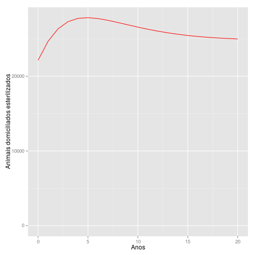
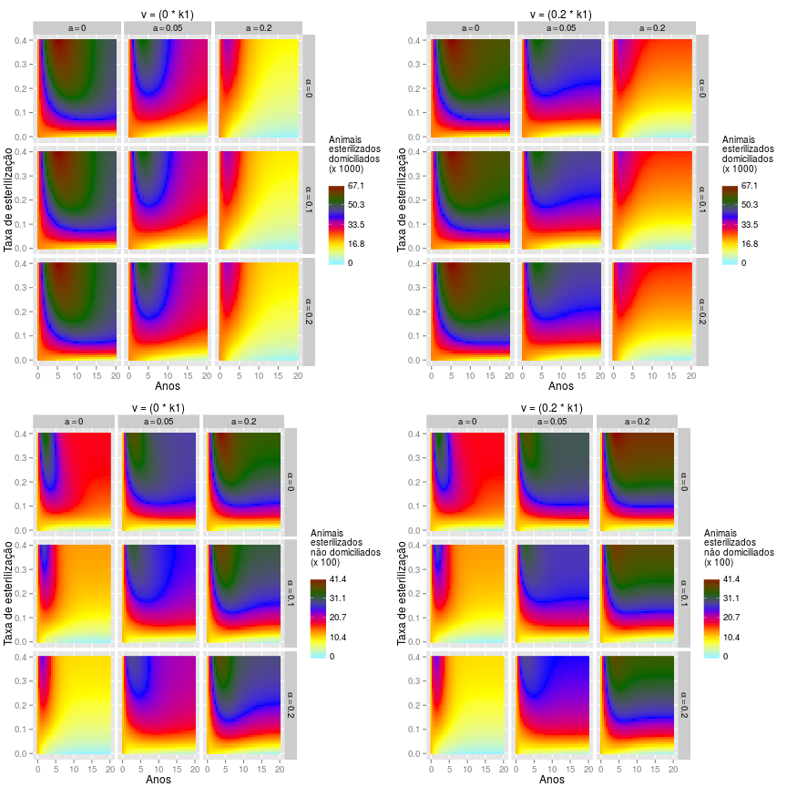

Agora estamos prontos para simular o efeito da imigração, o abandono, a esterilização e a adoção, na dinámica populacional de cães domiciliados e não domiciliados. A função `SolveIASA` usa vários parámetros em um modelo de dinâmica populacional. Alguns parâmetros são de cães domiciliados e outros de cães não domiciliados (a página de ajuda de `SolveIASA` describe las abreviaciones de os parámetros).  

Temos estimativas para quase todos os parâmetros da população de cães domiciliados mas não temos estimativas para a população de cães não domiciliados. Com base na literatura e na opinião de expertos, podemos definir estimativas subjetivas para a população de não domiciliados (na seguiente seção avaliaremos que tanto as estimativas subjetivas comprometen os resultados do modelo).

Valores para definir as condições iniciais.


```r
> # cães domiciliadoss       # cães não domiciliados
> f1 <- 39565 - 12783;    f2 <- f1 * 0.1
> fs1 <- 12783;           fs2 <- fs1 * 0.05
> m1 <- 50289 - 9346;     m2 <- m1 * 0.1
> ms1 <- 9346;            ms2 <- ms1 * 0.05
```

Valores para definir os parâmetros.


```r
> # cães domiciliadoss       # cães não domiciliados
> b1 <-  7724;            b2 <- b1 * 0.15
> df1 <- 0.046;           df2 <- df1 * 1.15
> dm1 <- 0.053;           dm2 <- dm1 * 1.15
> sf1 <- 0.13;            sf2 <- sf1 * 0.05
> sm1 <- 0.043;           sm2 <- sm1 * 0.05
> k1 <- (f1 + m1) * 1.1;  k2 <- (f2 + m2) * 1.1
> h1 <- 1;                h2 <- 0.5;
> a <- 0.05;              alpha <- 0.104;
> v <- 0.147
> z <- v * 0.11
```

Parâmetros e condições iniciais.


```r
> init.solve.iasa = c(
+     f1 = f1, fs1 = fs1,
+     m1 = m1, ms1 = ms1,
+     f2 = f2, fs2 = fs2,
+     m2 = m2, ms2 = ms2)
> 
> pars.solve.iasa = c(
+     b1 = b1, b2 = b2, df1 = df1,
+     dm1 = dm1, df2 = df2, dm2 = dm2,
+     sf1 = sf1, sf2 = sf2, sm1 = sm1,
+     sm2 = sm2, k1 = k1, k2 = k2,
+     h1 = h1, h2 = h2, a = a,
+     alpha = alpha, v = v, z = z)
```

Solucionar o modelo para as estimativas pontuais é simples.


```r
> solve.iasa.pt <- SolveIASA(
+     pars = pars.solve.iasa,
+     init = init.solve.iasa,
+     time = 0:20, method = 'rk4')
```

Podemos estar interessados em que tanto mudam diferentes subpopulações através do tempo. Por exemplo, calculemos a mudança relativa do total de cães domiciliados esterilizados, desde o começo até o final do período simulado


```r
> CalculatePopChange(
+     model.out = solve.iasa.pt,
+     variable = 'ns1',
+     t1 = 0, t2 = 20)
```

```
[1] At t2, ns1 is 12.94% higher than (or 112.94% times) ns1 at t1.
```

e a mudançao absoluta do total de fêmeas não domiciliadas e não esterilizadas, entre o quinto e o décimo ano.


```r
> CalculatePopChange(
+     model.out = solve.iasa.pt,
+     variable = 'fs2',
+     t1 = 5, t2 = 10, ratio = F)
```

```
Compared with t1, in t2 fs2 is increased by 54.91
```

A dinámica de diferentes subpopulações tambem pode ser plotada (var a página de ajuda de `PlotModels`).


```r
> PlotModels(model.out = solve.iasa.pt,
+            variable = 'ns1',
+            x.label = 'Anos',
+            y.label = 'Animais domiciliados esterilizados')
```

 

Também podemos simular cenários para avaliar a interação entre diferentes combinações de taxas de esterilização, de abandono, de adopção e de imigração. No seguiente exemplo criaremos 900 cenários (50 taxas de esterilização, 3 taxas de abandono, 3 taxas de adopção e 2 taxas de imigração).


```r
> solve.iasa.rg <- SolveIASA(
+     pars = pars.solve.iasa,
+     init = init.solve.iasa,
+     time = seq(0, 20, by = 0.5),
+     s.range = seq(from = 0, to = 0.4,
+                   length.out = 50),
+     a.range = c(0, .2),
+     alpha.range = c(0, .2),
+     v.range = c(0, .2),
+     method = 'rk4')
> PlotModels(model.out = solve.iasa.rg,
+            variable = 'ns',
+            x.label = 'Anos',
+            y.label = 'Taxa de esterilização',
+            scenarios.label = 'v = (__ * k1)',
+            legend.label = c('Animais\nesterilizados\ndomiciliados',
+                             'Animais\nesterilizados\nnão domiciliados'))
```

 
