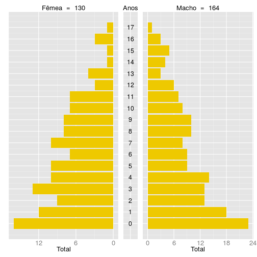
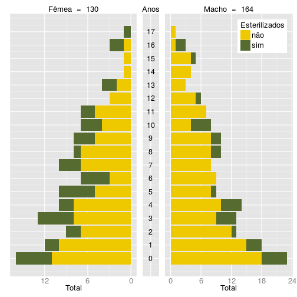

```
## Error in options(width == 66): object 'width' not found
```


As pirâmides populacionais resumem a composição básica da população. Como mínimo, são construidas a partir das variáveis "idade" e "sexo", mas podem estar condicionadas por uma terceira variável categórica. As variáveis devem ser espcificadas nos respectivos argumentos da função.  

Antes de criar as pirâmides, mudemos as categorias das variáveis "sexo" e "esterilizado" para que o texto dos gráficos fique em português.


```r
> survey.data[ , 4] <- as.character(survey.data[ , 4])
> survey.data[ , 4] <-
+     ifelse(survey.data[ , 4] == 'Female', 'Fêmea', 'Macho')
> survey.data[ , 4] <- as.factor(survey.data[ , 4])
> survey.data[ , 6] <- as.character(survey.data[ , 6])
> survey.data[ , 6] <-
+     ifelse(survey.data[ , 6] == 'yes', 'sim', 'não')
> survey.data[ , 6] <- as.factor(survey.data[ , 6])
> matrix(names(survey.data), ncol = 1)
```

```
      [,1]                     
 [1,] "interview_id"           
 [2,] "psu"                    
 [3,] "dogs"                   
 [4,] "sex"                    
 [5,] "age"                    
 [6,] "sterilized"             
 [7,] "sterilized.ly"          
 [8,] "births"                 
 [9,] "present"                
[10,] "fate"                   
[11,] "acquired"               
[12,] "outside"                
[13,] "acquired.ly"            
[14,] "immigrant"              
[15,] "immigrant.ly"           
[16,] "immigrant.sterilized.ly"
```


```r
> PlotPopPyramid(dat = survey.data,
+                age.col = 'age',
+                sex.col = 'sex',
+                stage.label = 'Anos')
```

 

```r
> PlotPopPyramid(dat = survey.data,
+                age.col = 5,
+                sex.col = 4,
+                str.col = 6,
+                stage.label = 'Anos',
+                legend.label = 'Esterilizados')
```

 


